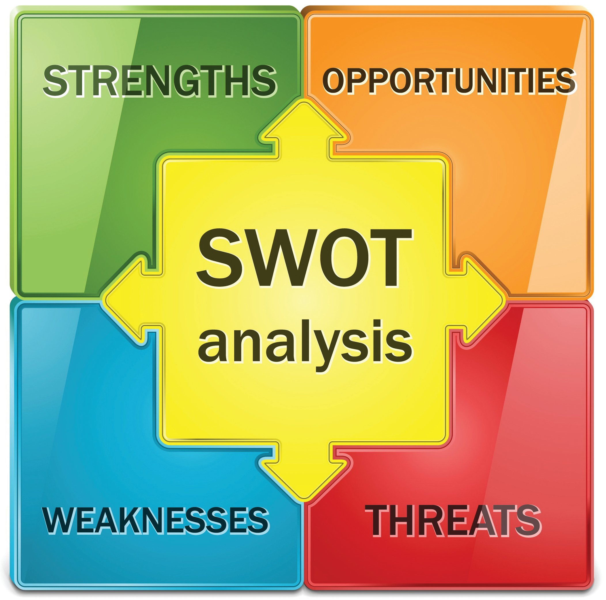

# Description
Last few years have been challenging for everyone of us due to "CORONA".So it is important for everyone to maintain social distance.As we know when we want to travel from one place to another there will be toll gates at some places.Instead of giving money to hand on hand i made a project when we get registered with our vehicle number the gate will be open and closed automatically with our registerd vehicle number.
As we know due to heavy population there will be more number of people travel from one place to other it is better to avoid physical contact and also helps for saving the time
So this project helps to avoid these problems and come up with a better solution.For example if we want to travel from one place to other the tollgates will be automatically send us without physical contact with our vehicle number.If the vehicle registered with 10tolls then after the 10tolls it no more helps in sending the vehicle directly so we have to update the registered vehicle numer.

## High Level Requirements
|ID|Descrption|Status|
|--|----------|------|
|HR01|User can make registrations after the verification is successful|Implemented|
|HR01|User can make new registrations|Implemented|
|HR03|User can move up or down,Up and down|Implemented|
|HR02|Two step authentication|Not implemented|
|HR03|Date of expiry for the vehicle registration|Not Implemented|

## Low Level Requirements
|ID|Description|Status|
|--|-----------|------|
|LR01|User can select required direction|Implemented|
|LR02|Can able to add new vehicles|Implemented|
|LR03|Can able to know whether the online registration can be done in that toll area|Not implemented|
## SWOT

## Strength
*Stength of this project is to make the toll travel simpler and easier keeping in mind of present situations
## Threat
*Threat here is there is no Two step authentication done and many of the users using thier personal data for verification.
## Weakness
*Weakness is we cannot able to know where are the toll places we unable to work this on.
## Opportunities
*Opportunity is we can know how many tollgates are present in the direction we travel.
        
## 4W's & 1H 
### WHO
User must travel without physical contact with toll gate officer and make it simple.
### WHAT
To verify the user vehicle number.
### WHEN
It is done at the time where the vehicle pass by tollgate.
### WHERE
At the tollgates.
### HOW
The user will be registered and also verifying the details

**Used idea from amith nair but made changes to it except the idea, remaining are different.
